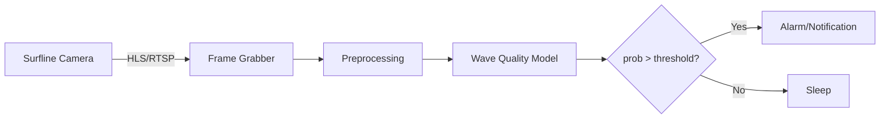

# Wave-Clock

A Python-based AI alarm that analyzes live Surfline camera feeds and wakes you up when the waves are pumping.

---

## Table of Contents

1. [Project Overview](#project-overview)
2. [Features](#features)
3. [Architecture](#architecture)
4. [Installation](#installation)
5. [Usage](#usage)
6. [Configuration](#configuration)
7. [Model Training](#model-training)
8. [Deployment](#deployment)
9. [Contributing](#contributing)
10. [License](#license)

---

## Project Overview

Wave-Clock hooks into a Surfline live camera stream, runs a real-time computer vision model to evaluate wave quality, and sends an alarm (audio/notification) when conditions meet your custom threshold.

**Key goals:**\*\*

* Autonomous, headless operation (Raspberry Pi or VPS)
* Customizable "good wave" criteria via model training
* Flexible alert channels (speaker, SMS, push notification, smart devices)
* Logging and tuning of detection thresholds

---

## Features

* **Live Stream Ingestion:** Connects to HLS/RTSP feed
* **Wave Quality Classification:** CNN-based model for "good" vs "bad"
* **Configurable Thresholds:** Balance between misses & false alarms
* **Alarm Options:** Local audio, Pushbullet, Twilio SMS, MQTT, etc.
* **Scheduler:** Run only at sunrise or custom time windows
* **Logging:** Timestamped probabilities for analysis

---

## Architecture



---

## Installation

1. Clone this repo:

   ```bash
   git clone https://github.com/yourusername/Wave-Clock.git
   cd Wave-Clock
   ```
2. Create a Python virtual environment and install dependencies:

   ```bash
   python3 -m venv venv
   source venv/bin/activate
   pip install -r requirements.txt
   ```

---

## Usage

1. **Configure** your camera URL and alarm settings in `config.yaml`.
2. **Run** the main script:

   ```bash
   python surfwake.py --config config.yaml
   ```
3. **Monitor** the console or logs for probability scores and triggers.

---

## Configuration

Example `config.yaml`:

```yaml
camera_url: "https://.../stream.m3u8"
sample_interval: 60  # in seconds
model_path: "models/wave_classifier.pt"
threshold: 0.8
alarm:
  type: "pushbullet"
  api_key: "YOUR_API_KEY"
schedule:
  start_hour: 5
  end_hour: 8
logging:
  file: "surfwake.log"
```

---

## Model Training

1. **Data Collection:** Run the frame grabber in data mode to scrape labeled images.
2. **Annotation:** Label frames as `good/bad` (use weak labels or manual curation).
3. **Training:** Adjust `train.py` hyperparameters and launch:

   ```bash
   python train.py --data data/ --output models/wave_classifier.pt
   ```
4. **Validation:** Evaluate on held-out set and tune the threshold.

---

## Deployment

* **Raspberry Pi:**

  * Use `systemd` or `cron` to start `surfwake.py` at boot.
* **Cloud VM:**

  * Dockerize the application (see `Dockerfile`).
  * Deploy on AWS/GCP/Heroku.

---

## Contributing

1. Fork the repo
2. Create a feature branch (`git checkout -b feature/your-feature`)
3. Commit your changes (`git commit -am 'Add feature'`)
4. Push to the branch (`git push origin feature/your-feature`)
5. Open a Pull Request

---

## License

This project is licensed under the MIT License. See [LICENSE](LICENSE) for details.
